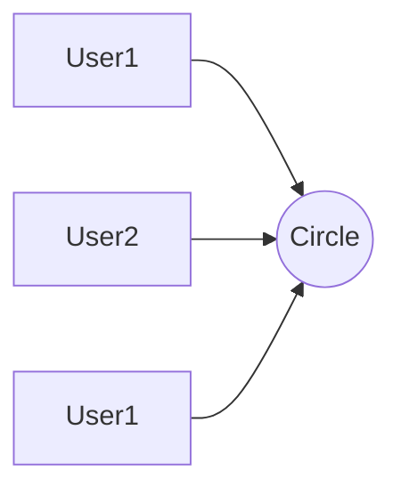

## RBAC
基于角色的权限访问控制（Role-Based Access Control）作为传统访问控制（自主访问，强制访问）的有前景的代替受到广泛的关注。在RBAC中，权限与角色相关联，用户通过成为适当角色的成员而得到这些角色的权限。这就极大地简化了权限的管理。

### RBAC0

<!--stackedit_data:
eyJoaXN0b3J5IjpbLTU0MjM3MDk2OCwyMTY3MzI1NTQsMTIyND
k5MDM0Nl19
-->