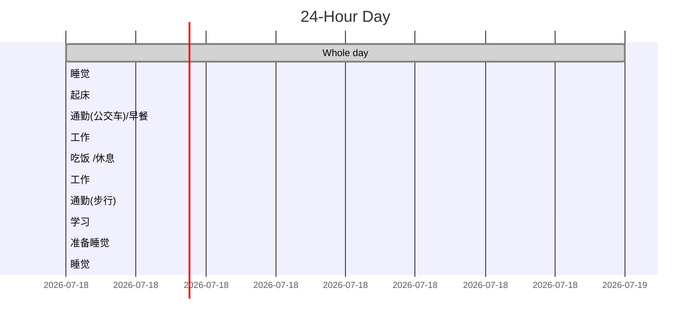

```mermaid
gantt
    dateformat HH:mm
    Title 24-Hour Day
    Whole day: done, 00:00, 1440m
    睡觉:crit, sleep2,after 00:00, 450m <--! 00:00-7:30 -->
    起床: get_up,after sleep2, 30m  <--! 7:30-8:00 -->
    通勤(公交车)/早餐: commute1,after get_up, 60m <--! 8:00-9:00 -->
    工作 :active,work1,after commute1,180m <--! 9:00-12:00 -->
    吃饭 /休息 : rest,after work1,90m <--! 12:00-13:30 -->
    工作 :active,work2,after rest,330m <--! 13:30-19:00 -->
    通勤(步行) : commute2,after work2,90m  <--! 19:00-20:30 -->
    学习:crit, study,after commute2,120m <--! 20:30-22:30 -->
    准备睡觉: pre_sleep,after study,30m <--! 22:30-23:00 -->
    睡觉 : crit,sleep1,after pre_sleep,60m <--! 23:00-00:00 -->
```
<!--stackedit_data:
eyJoaXN0b3J5IjpbLTE1MTc1MzkwODEsNTY2NzM0NzcyXX0=
-->